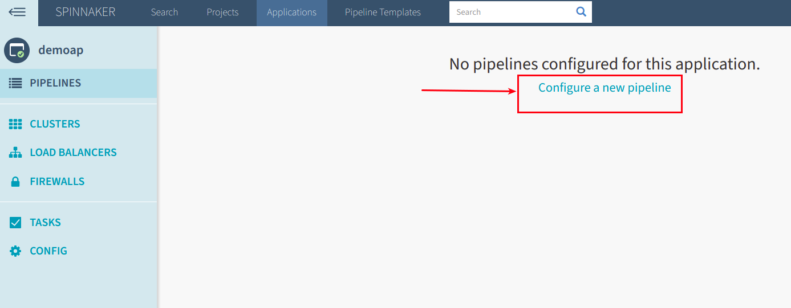
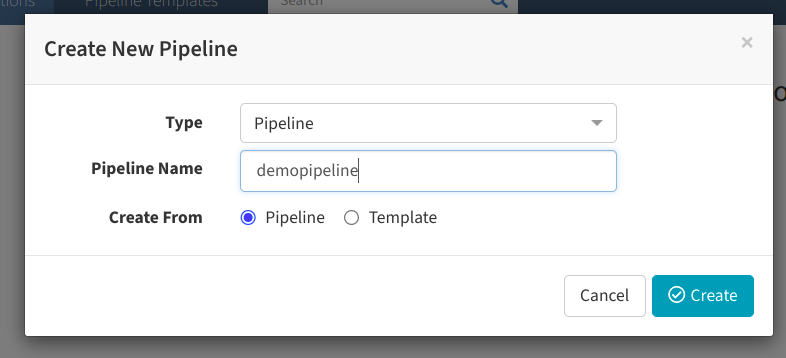
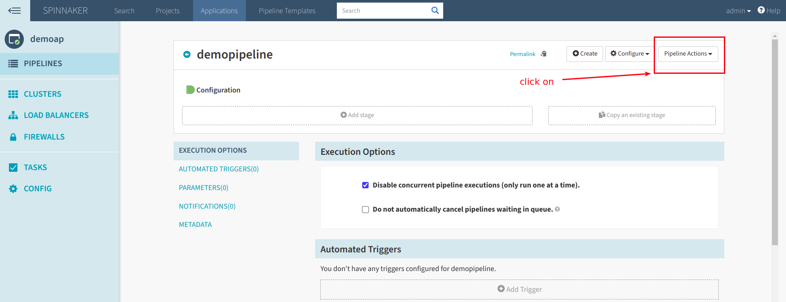
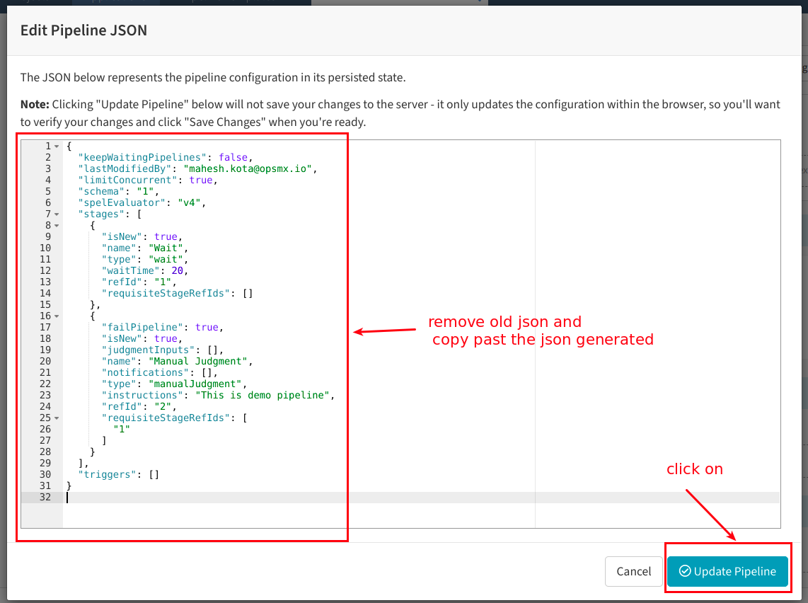
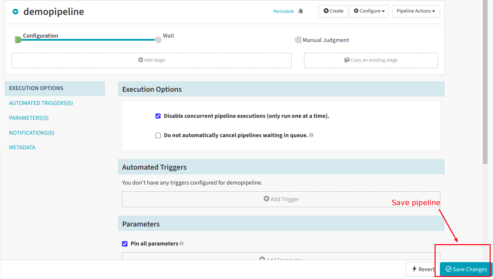
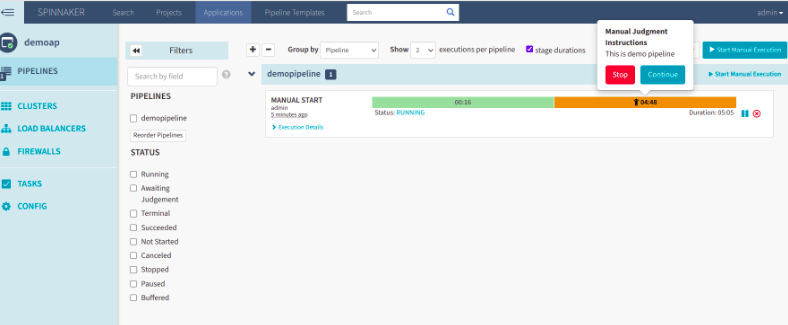

# pipeline-json

## Architecture (Draft)

## Steps to be followed 

1.  Clone the repo 

        git clone https://github.com/maheshopsmx/pipeline-json.git
    
        cd pipeline-json

2. Specify the stages in the stage-input.yml (for now it supports wait and manujudgement stages)

       stages: 
         waitstage:        #stage 1 and parameters
            waitTime: 20    # ignore if not change
         manualjudgement:                       # stage 2 and parameters
            instructions: This is demo pipeline  # ignore if no change 

3. Run the script

        bash run.sh
        
4. Once it is ran in output it will prints the pipeline json and  save it to the spinnaker

5. It can also be saved in  complete_pipeline.json

6. Take the pipeline json and create spinnaker pipeline

 -  **Click on create pipeline**
 

  - **Click on pipeline action**

  - **Click on edit as json**

  - **Remove old json and copy paste the new json**

  - **finally save the pipeline**

 
  - **Now run the pipeline**

  - **Pieline Execution will be as below**

