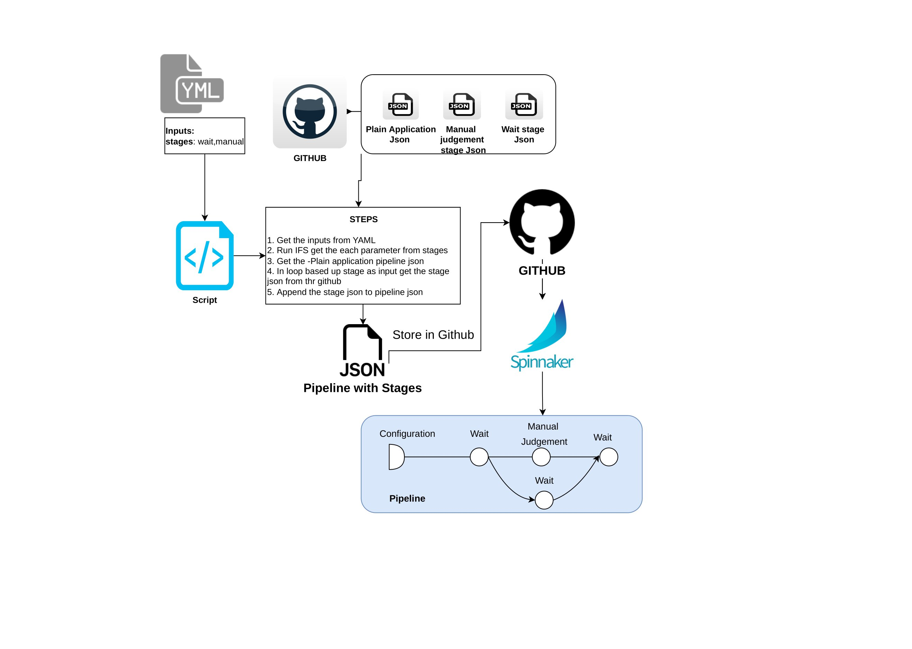

# pipeline-json

## Architecture (Draft)

## Steps to be followed 

1.  Clone the repo 

        git clone https://github.com/maheshopsmx/pipeline-json.git
    
        cd pipeline-json

2. Specify the stages in the stage-input.yml

3. Run the script

        bash run.sh

