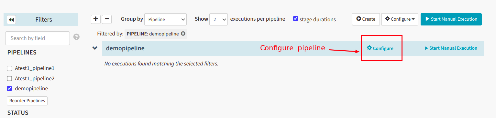
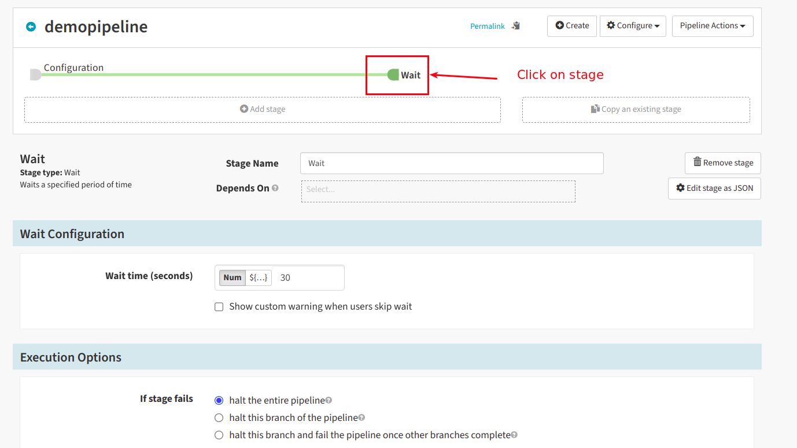
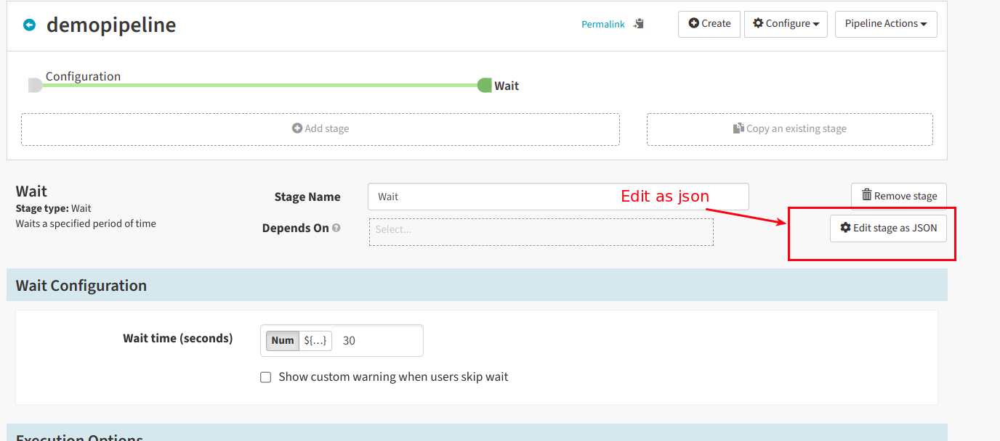
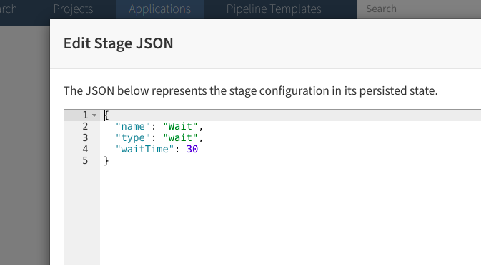

# pipeline-json

This folder contains the stage json are saved as a templetes.

Each Spinnaker Pipeline it has it's own json and each stage will have it's own json. 

**plain_pipeline_template.json**  : It is plain pipleine which will have only configuration with out any stages

**manualjudgement_stage.json** : It contains only manualjudgement stage json.

**waitstage.json** : It contains only the wait stage json.

### How to get the stage jsons

1. **Go to the spinnaker pipeline**

  
  
2. **Click on the stage**

  

3. **Click on edit as json**

  

4. **This json is saved as a stage json as a templete**

  
